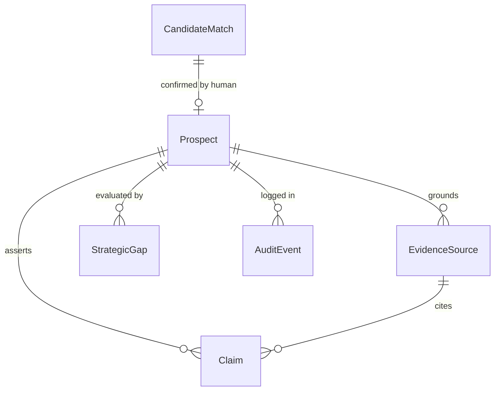
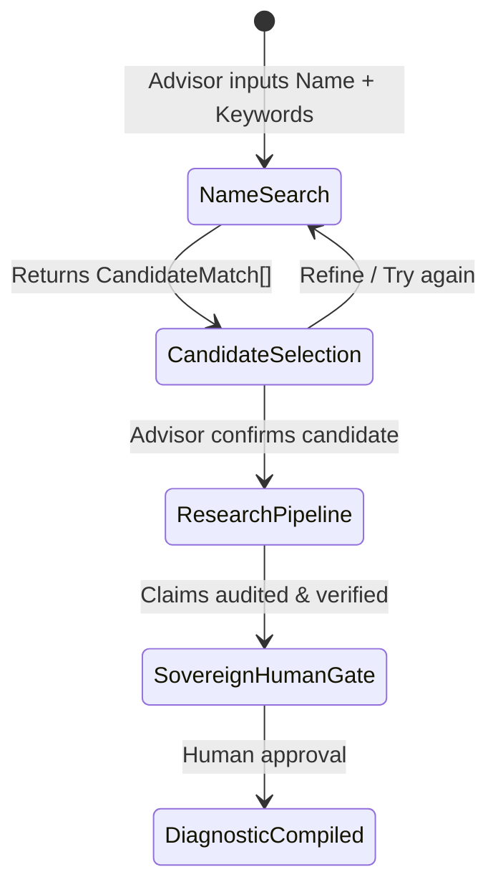

# Data Model: Name-Based Search & Global Authority Verification

**Feature**: `002-name-search-verification`  
**Date**: 2026-09-17  
**Status**: Draft

---

## 1. New Entities

### `CandidateMatch`
Represents a candidate profile retrieved during name-based public discovery before initiating deep intelligence research.

| Field | Type | Description | Constraints / Validation |
| :--- | :--- | :--- | :--- |
| `candidate_id` | `UUID` | Unique identifier for candidate session | Default UUIDv4 |
| `full_name` | `str` | Person's display name from profile | Non-empty, 1-200 chars |
| `headline` | `Optional[str]` | Current professional headline / title | e.g. "Prime Minister of India" |
| `current_company`| `Optional[str]` | Detected current company or organization | Max 200 chars |
| `location` | `Optional[str]` | Geographic location / country | e.g. "New Delhi, India", "Dubai, UAE" |
| `linkedin_url` | `str` | Canonical LinkedIn public profile URL | Must contain `linkedin.com/in/` |
| `snippet` | `Optional[str]` | Public OSINT search preview snippet | Summary context |
| `relevance_score`| `float` | Query relevance score (0.0 to 1.0) | Default 1.0 |

---

## 2. Modified Entities

### `Prospect` (in `src/storage/models.py`)
Extended to support adaptive jurisdiction, sector classification, and provenance from candidate confirmation.

| Field | Type | Status | Description |
| :--- | :--- | :--- | :--- |
| `prospect_id` | `UUID` | Existing | Unique prospect identifier |
| `linkedin_url` | `str` | Existing | Canonical LinkedIn URL |
| `slug` | `str` | Existing | Extracted profile slug |
| `full_name` | `str` | Existing | Full verified name |
| `current_company`| `Optional[str]` | Existing | Verified current organization |
| `primary_role` | `Optional[str]` | Existing | Executive role / headline |
| `location_country`| `str` | **Modified** | Dynamic country (e.g. "India", "UAE", "USA"), NOT hardcoded |
| `sector` | `str` | **New** | Inferred sector (e.g. "Public Governance", "Technology") |
| `status` | `ProspectStatus` | Existing | `INITIALIZED` → `RESEARCHING` → `GATE_PENDING` → `APPROVED` |
| `created_at` | `datetime` | Existing | UTC creation timestamp |
| `updated_at` | `datetime` | Existing | UTC last updated timestamp |

### `SourceTier` (in `src/storage/models.py`)
Enhanced tier definitions with universal global sovereign registry semantics:

| Tier Enum | Grounding Scope | Validation Rule |
| :--- | :--- | :--- |
| `TIER_1_PRIMARY` | Sovereign Registries, State Portals, Official Corporate Domains, Accredited Universities | Matches `.gov`, `.gov.*`, `.nic.in`, `.mil`, `.edu`, `.ac.*`, or verified corporate domain |
| `TIER_2_SECONDARY` | Reputable Global Financial & Wire Press | Bloomberg, Reuters, FT, WSJ, The Hindu, Economic Times, The National |
| `TIER_3_AGGREGATOR`| Public Directories, Wikis, Professional Associations | Wikipedia, Crunchbase, ZoomInfo (Discovery ONLY, never Check 1) |
| `TIER_4_SOCIAL` | Social Feeds, Unverified Blogs, Forums | X/Twitter, Reddit, unverified Medium posts (Quarantined) |

---

## 3. Entity Relationships

---

## 4. State Transitions

